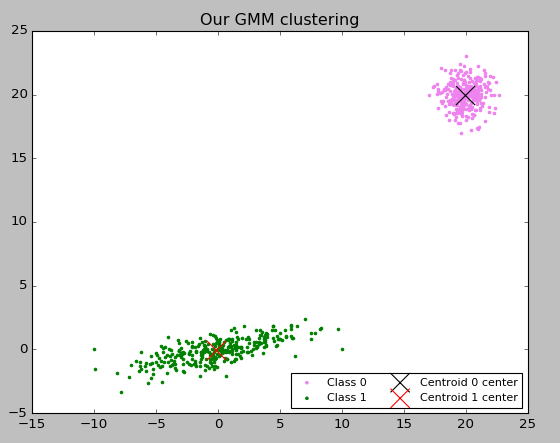
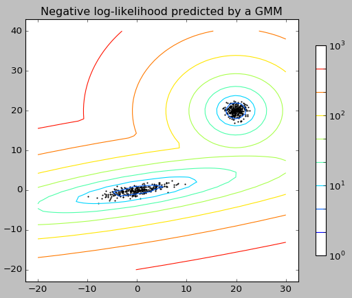

# GMM

The goal was to implement Gaussian Mixture Model thanks to the Expectation/Maximization algorithm. We generated 600 points with a set seed and created a density estimation out of these points.

Since we had to implement ourselves the whole method, we used a lot of the mathematics that was given to us in class, especially the big formula to compute in the E/M algorithm.

So, we:

- --Generated the data : two group of Gaussian data used as a dataset
- --Initialized the variables we needed ( : they were initialised randomly
- --Calculated and used the E/M algorithm in order to fit the model,
- --Added new data to test our model : 6 point, 3 for each clusters
- --We tested them : they were all well clustered
- --Plotted the results of our clustering

**Results** :

**Our GMM Model clustering** 
  

**The Scikit Learn GMM Model** 
 

- As we can see, **all the elements of the dataset were well clustered** , including our test data.
- Since the **E/M algorithm is extremely efficient** , only a few iterations (always less than 6, it depended on the seed) were needed for to converge with an of 10

