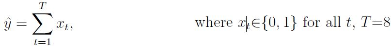

We would like to would like to construct a robot that makes a decision based on a signal. This signal consists of 8 bits, and the robot makes decisions based on the sum of these bits. Here we will construct a binary addition
module using a recurrent neural network (RNN) with the following input-output relationship:
 
  
